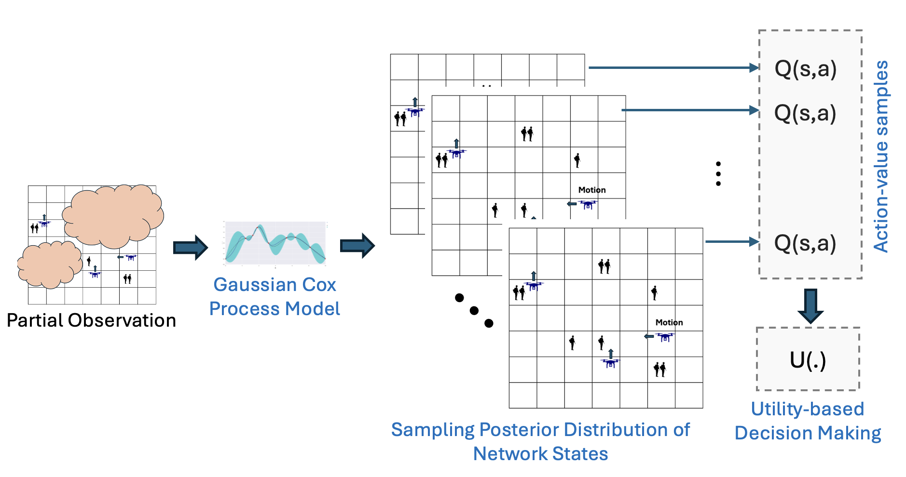

# LAMPS: A Learning-based Mobility Planning via Posterior State Inference using Gaussian Cox Process Models

## Overview

This repository implements a novel framework for UAV mobility planning under **dynamic partial observability** using Gaussian Cox Process Models for posterior state inference and utility-based decision-making. The LAMPS framework leverages probabilistic state estimation to enable UAVs to adapt to evolving environments without the need for retraining. By integrating reinforcement learning algorithms with Gaussian Cox Process-based state inference, it ensures robust and adaptive mobility planning.

<p align="center">
    
</p>

---

## Frameworks Used

1. **pymarl2**: This framework is employed for multi-agent reinforcement learning (MARL) training. It provides robust tools to implement and train MARL algorithms such as QMIX. [pymarl2 Repository](https://github.com/hijkzzz/pymarl2)  
2. **Custom UAV Environment with Bayesian Controller**: The environment is specifically designed for UAV mobility tasks, including enhancements to incorporate a controller for decision-making. This environment is fully compatible with Pymarl and allows flexible configuration for UAV-related observability and state-action spaces.
3. **Estimation Module**: The estimation process, including posterior state inference and utility-based decisions, is based on the Gaussian Cox Process model, adapted from the gaussian_co_box framework. [gaussian_co_box Repository](https://github.com/ysmei97/gaussian_cox_bo)

---

## Installation instructions

Install Python packages

```shell
# require Anaconda 3 or Miniconda 3
conda create -n LAMPS python=3.8 -y
conda activate LAMPS

bash install_dependecies.sh
```

## Command Line Tool

**Train a model**
```shell
python3 src/main.py --config=qmix --env-config=ENV env_args.observability=OBS name=MODEL_NAME
```

 * ENV --> uav_env_small or uav_env_large,

* OBS --> An integer representing observability radius. 0 for full observability,

* MODEL_NAME --> Model name to save.


**Evaluation of a model**
```shell
python3 -W ignore src/main.py  --config=qmix --env-config=ENV env_args.observability=OBS name=MODEL_NAME estimation=EST utility=UTI evaluate=True batch_size_run=1 runner=episode run=test_run mac=bayesian_controller
```
* ENV --> uav_env_small or uav_env_large,

* OBS --> An integer representing observability radius. 0 for full observability,

* MODEL_NAME --> Model name to load,

* EST --> True or False to decide use of estimation,

* UTI --> The utility function. Options: 'random', 'expected', 'risk-averse' (default='expected').


The config files act as defaults for an algorithm or environment.

They are all located in `src/config`.
`--config` refers to the config files in `src/config/algs`
`--env-config` refers to the config files in `src/config/envs`

